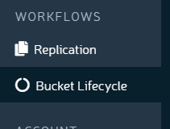
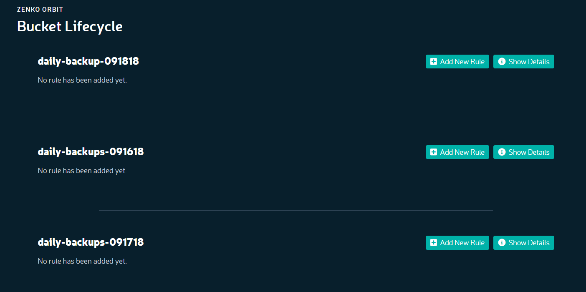
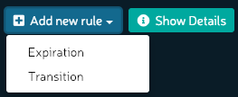

Object Lifecycle Management
===========================

**Prerequisite:** You must have established at least one bucket.

#. From anywhere in Orbit, click the **WORKFLOWS > Bucket Lifecycle** tab in 
   the left navbar.

   |image0|

#. The **Bucket Lifecycle** screen displays.

   |image1|

#. Choose a bucket and pick **Add New Rule > Expiration**

   |image2|

#. The **Add New Expiration Rule** dialog displays:

   |image3|

   You may enter a distinct directory or subdirectory to which the rule applies.
   Enter an expiration time span and a deletion time span.
   These follow the bucket and enforce expiration and deletion.
   You may also add a comment about this expiration rule.

   Click **Save**.

#. The new rule is displayed:

   |image4|

   Zenko will enforce these rules on this bucket. If replication is
   configured, any change of state to objects in this bucket can be
   replicated to buckets on other clouds.

Versioning logic precludes simply deleting an object: that day’s object
is deleted, but all others remain. See warning at “Deleting Files,” on
page 1.

.. |image3| image:: ../../Resources/Images/Orbit_Screencaps/Orbit_lifecycle_add_expiration_rule.png
   :scale: 50 %
.. |image4| image:: ../../Resources/Images/Orbit_Screencaps/Orbit_lifecycle_rule_success.png
   :class: OneHundredPercent
